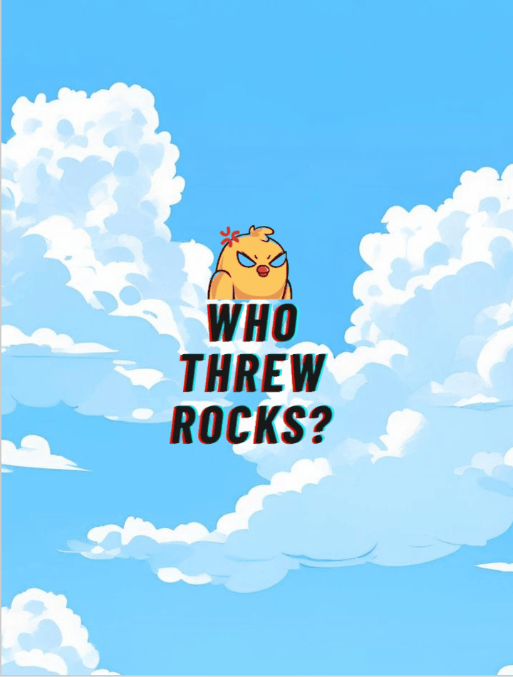
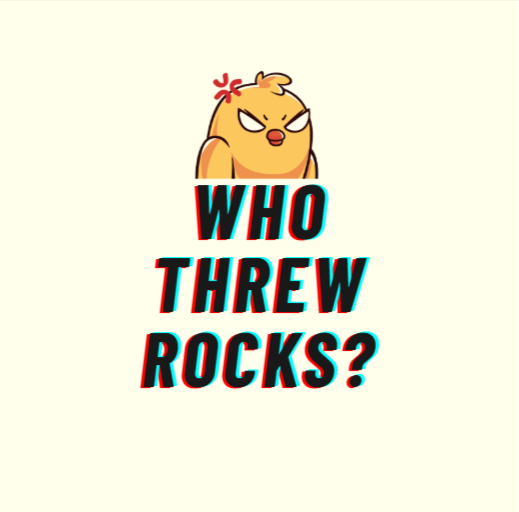

# 🪨 Who Threw Rocks? 🐦

[](https://www.python.org/downloads/)
[](https://www.pygame.org/)
[](LICENSE)
[]()

> **A thrilling survival game where you control a brave bird dodging deadly falling rocks!**

### 🎬 Gameplay Demo
 

## 🎮 Game Overview

**Who Threw Rocks?** is an exciting arcade-style survival game built with Python and Pygame. Guide your feathered friend through a dangerous sky filled with falling rocks while the timer counts up. How long can you survive the rocky rain?

### 🎯 Objective
- **Survive as long as possible** while rocks fall from the sky
- **Avoid all falling rocks** - one hit and it's game over!
- **Beat your high score** and challenge your reflexes

## 🕹️ How to Play

### Controls
- **Arrow Keys** - Move your bird around the screen
  
### Gameplay
1. **Start the game** and watch the introduction
2. **Move your bird** to avoid the falling rocks
3. **Survive as long as possible** - the timer shows your survival time
4. **Game over** when you hit a rock - try to beat your record!

## 🚀 Installation & Setup

### Prerequisites
- Python 3.7 or higher
- Pygame library

### Quick Start
1. **Clone the repository**
   ```bash
   git clone https://github.com/Tweakkin/who_threw_rocks.py.git
   cd who_threw_rocks.py
   ```

2. **Install Pygame**
   ```bash
   pip install pygame
   ```

3. **Run the game**
   ```bash
   python who_threw_rocks.py
   ```

## 📁 Project Structure

```
who_threw_rocks.py/
├── who_threw_rocks.py      # Main game file
├── game_utils.py           # Game utility functions
├── imgs/                   # Game images
│   ├── background.jpeg     # Game background
│   ├── bird.png           # Player sprite
│   ├── rock_2.png         # Rock sprite
│   └── intro.png          # Introduction screen
├── sounds/                 # Game audio
│   ├── game_over.mp3      # Game over sound
│   └── game_sound.mp3     # Background music
└── README.md              # This file
```

## ✨ Features

- 🎵 **Immersive Audio** - Background music and sound effects
- 🎨 **Beautiful Graphics** - Custom sprites and background art
- ⏱️ **Real-time Timer** - Track your survival time
- 🎮 **Smooth Controls** - Responsive bird movement
- 💥 **Collision Detection** - Precise hit detection
- 🔄 **Endless Gameplay** - Rocks continuously spawn
- 📱 **Introduction Screen** - Welcoming game intro

## 🎯 Game Mechanics

### Difficulty
- **3 rocks** spawn simultaneously
- **Rocks fall at 2x speed** for increased challenge
- **Random spawn positions** keep you on your toes
- **Instant respawn** when rocks hit the bottom

### Scoring
- **Timer-based scoring** - survive longer for higher scores
- **Real-time display** shows your current survival time
- **Challenge yourself** to beat your personal best

## 🛠️ Technical Details

- **Resolution**: 720x950 pixels
- **Frame Rate**: 60 FPS
- **Player Size**: 150x75 pixels (bird)
- **Rock Size**: 30x30 pixels
- **Movement Speed**: 5 pixels per frame

## 🐛 Known Issues

- None currently! Report any bugs you find.

## 🙏 Acknowledgments

- **Pygame Community** for the amazing game development library
- **Python Software Foundation** for Python
- **Game Assets** - Thanks to the creators of the sprites and sounds used

## 📞 Contact

**Tweakkin** - [GitHub Profile](https://github.com/Tweakkin)

Project Link: [https://github.com/Tweakkin/who_threw_rocks.py](https://github.com/Tweakkin/who_threw_rocks.py)

---

### 🎮 Ready to Play?

```bash
git clone https://github.com/Tweakkin/who_threw_rocks.py.git
cd who_threw_rocks.py
pip install pygame
python who_threw_rocks.py
```

**Good luck surviving the rocky rain!** 🪨⚡🐦
